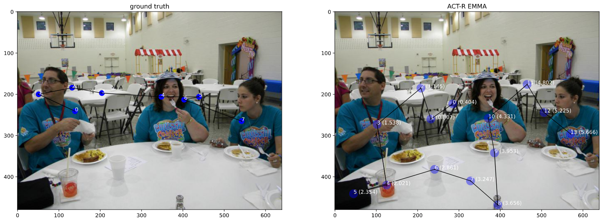
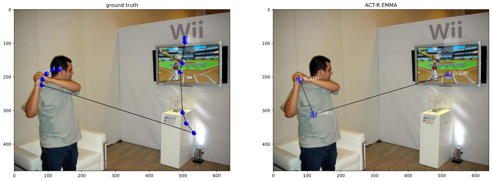

# Compare visual search results of ACT-R EMMA with SALICON and COCO-SEARCH-18 baseline models

A novel approach of devising visual search eye-tracking data using ACT-R EMMA(Salvucci, 2001). It can generate the fixation durations, object encoding time along with scanpath for all the object present in SALICON and COCO-SEARCH-18 datasets using YOLOv3 object recognition algorithm.

## Tasks (based on my personal interest)

### Task 1

We will generate Scanpaths for the following datasets with the help of ACT-R's visual search module

- SALICON: Derive encoding time for all objects present in a natural scene image based on YOLO v3 categories.
- COCO-Search-18: Derive encoding time for target search object based on 18 categories.

### Task 2 (not yet done)

Apply on videos

## Demo




## Setup

- Download the SALICON (LSUN) and Coco-Search-18 datasets, create a new directory 'data' and put them inside.

```bash
+-- data
|   +-- coco_search_18
|       +-- ...json
|       +--detected
|       +--images
|       +--simulations
|   +-- salicon
|       +--detected
|       +--images
|       +--simulations
+-- compare.py
+-- concat.py
+-- main.py
+-- multiactrsim.py
+-- yolov3.weights
```

- Download the yolov3 pre-trained weights from <https://pjreddie.com/media/files/yolov3.weights>
- Refer to `start.ps1` script for windows and `start.sh` script for linux systems

## Workflow

- **Object Recognition**
  - run `main.py`, for object recognition. It uses yolov3 with `probability threshold: 0.6`. For usage, refer to `start.sh` or `start.ps1`
  - check the output CSVs based on split under `data\[dataset]\detected`.
  - `concat.py`, for concatenating all the files into a single CSV file containing image names, list of objects as CSV rows.
  
- **ACT-R simulation**
  
  - `multiactrsim.py` - For usages, refer to  `start.sh` or `start.ps1`. It generates the output (CSVs) in `data\[dataset]\simulations`.
  
- **Evaluation**
  - `compare.py` - For usages, refer to  `start.sh` or `start.ps1`. Refer/Edit the code in case of any making any specific comparisions
  - `visual_search.ipynb` - Jupyter notebook for visualizing results and other comparison operations.
  
## Evaluation metrics

- **MultiMatch**: used in `compare.py`. For reference, see <https://multimatch.readthedocs.io/en/latest/>

- **ScanMatch**: The matlab script for scanmatch can be found in `results\matsrc.mat`.  For reference, see <https://seis.bristol.ac.uk/~psidg/ScanMatch/#Tutorial>

  - To run for SALICON, open the `matsrc.mat` in matlab, go inside the salicon folder. `results\salicon` and press `run`.

  - To run for COCO-SEARCH-18, open the `matsrc.mat` in matlab, go inside the coco-search-18 folder. `results\coco-search-18` and press `run`.

Set the parameters for evaluation in the `matsrc.mat` using the command `ScanMatchInfo = ScanMatch_Struct();`
For reference, see <https://seis.bristol.ac.uk/~psidg/ScanMatch/#Tutorial>
