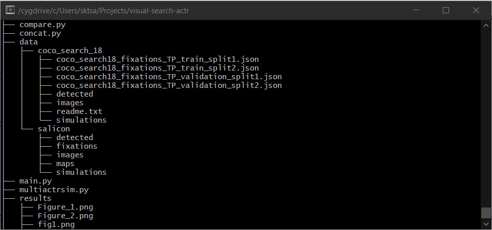

## Setup Instructions

- Download the SALICON (LSUN) and coco-search-18 datasets from the official websites.
- Create a new directory  'data' and put the datasets inside it.
 

- Download the yolov3 pre-trained weights from https://pjreddie.com/media/files/yolov3.weights and put it inside the main directory.
- Refer to start.ps1 script for windows and start.sh script for linux systems