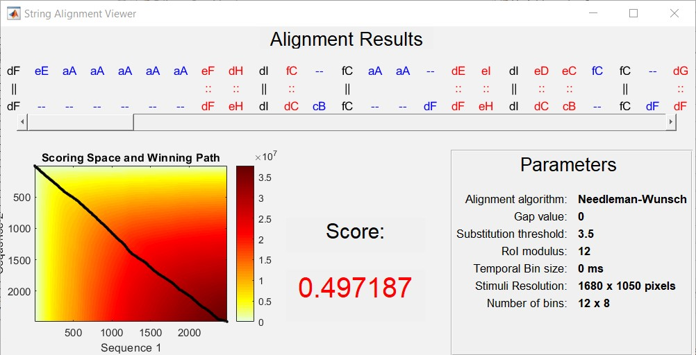

## Setup Instructions

- Download the SALICON (LSUN) and coco-search-18 datasets from the official websites.
- Create a new directory  'data' and put the datasets inside it.
 
- Download the yolov3 pre-trained weights from https://pjreddie.com/media/files/yolov3.weights and put it inside the main directory.
- Refer to `start.ps1` script for windows and `start.sh` script for linux systems

## Workflow 

- Object Recognition
  - `main.py`, for object recognition. It uses yolov3 with `probability threshold: 0.6` and generates the output (CSVs) in the dir : `data->dataset->detected`. For usage, refer to `start.sh` or `start.ps1` 
  - `concat.py`, for concatenating the files into a single object files containing image names and list of objects in it.
  
- ACT-R simulation:
  
  - `multiactrsim.py` - For usages, refer to  `start.sh` or `start.ps1`.  It generate the output (CSVs) in the dir : `data->dataset->simulations`. 
  
- Evaluation:
  - `compare.py` - For usages, refer to  `start.sh` or `start.ps1`. Refer to the code in case of any making any specific comparisions
  - `visual_search.ipynb` - Jupyter notebook for visualizing the results and other comparison operations.
  
## Evaluation metrics

- MultiMatch: used in `compare.py`. For reference, see https://multimatch.readthedocs.io/en/latest/

- ScanMatch: The matlab script for scanmatch can be found in `results->matsrc.mat`.  For reference, see https://seis.bristol.ac.uk/~psidg/ScanMatch/#Tutorial

  - To run for SALICON, open the `matsrc.mat` in matlab, go inside the salicon folder. `(results->salicon)` and press run. 

  - To run for COCO-SEARCH-18, open the `matsrc.mat` in matlab, go inside the coco-search-18 folder. `(results->coco-search-18)` and press run. 

  - You have to set the parameters for evaluation in the `matsrc.mat` using the command `ScanMatchInfo = ScanMatch_Struct();`  For reference, see https://seis.bristol.ac.uk/~psidg/ScanMatch/#Tutorial

    An example- 

    For my usecase, I set number of bin as 8*8 and Temporal Bin size as 200ms or 0ms. 